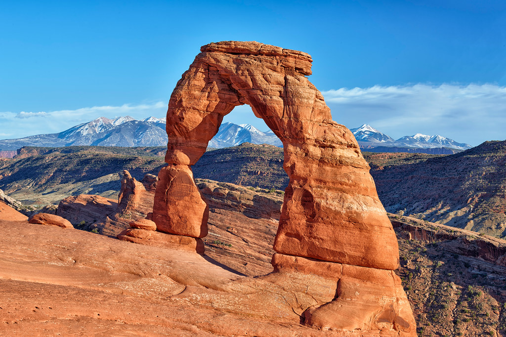
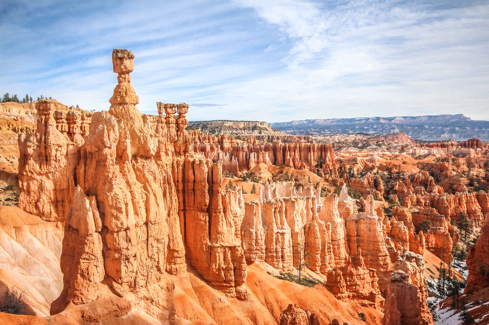
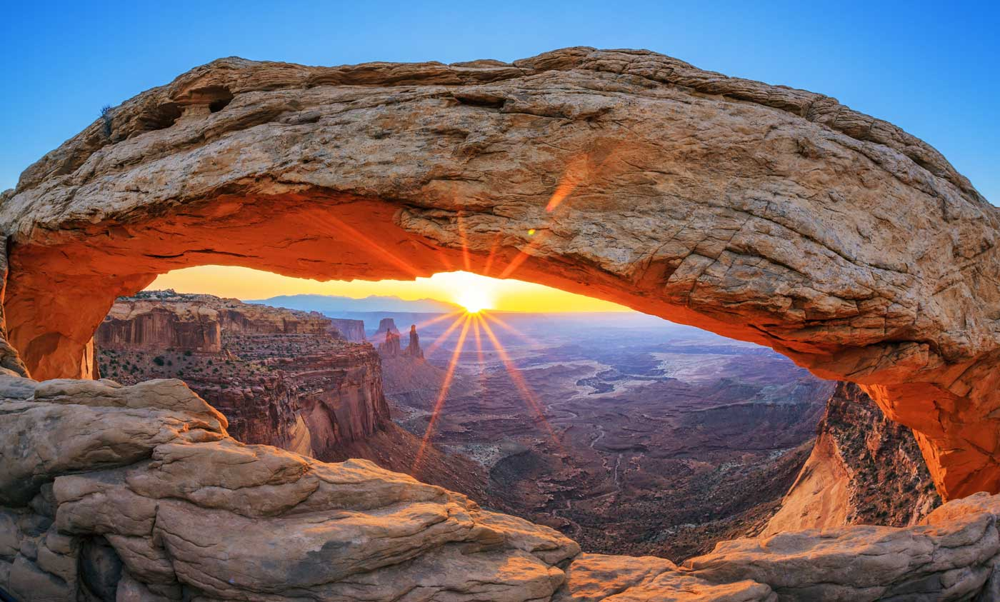
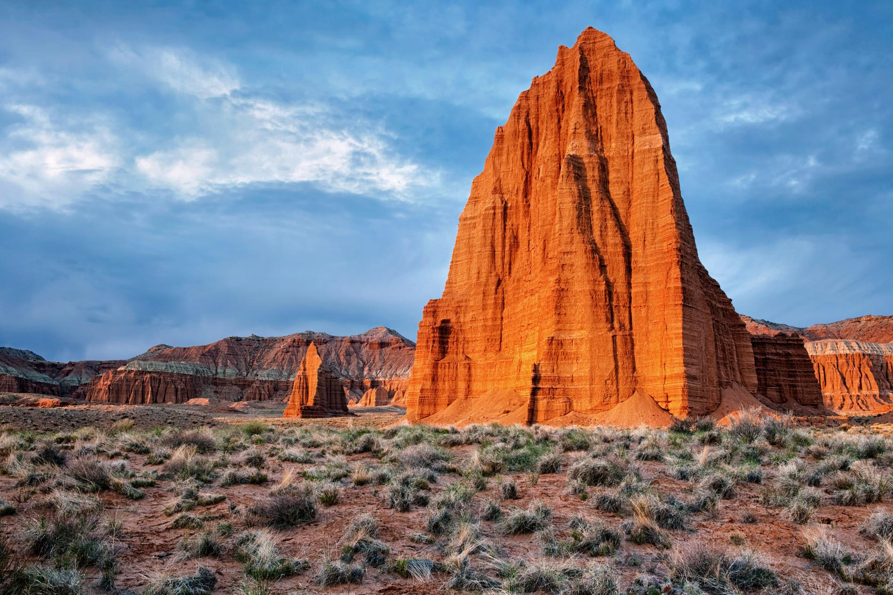

# Utah National Parks
Created for GEOG 472 at Oregon State University. This geovisualization project is a tour of the five national parks in the state of Utah using webslides. Utah's national parks, also known as the "Mighty Five", include:

**Arches National Park**

**Bryce Canyon National Park**

**Canyonlands National Park**

**Capitol Reef National Park**

**Zion National Park**

